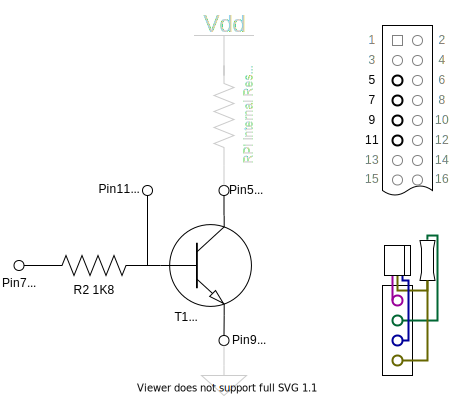
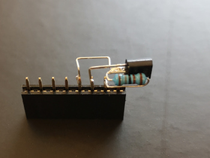
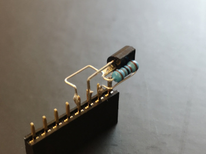

# UPSLite

## Start on external power

To start up the Raspberry Pi when the external power supply is connected,  
a small circuit is necessary, which is pulling down pin 3.  
A signal change of pin 3 initiates a wake up of the Pi if is halted.  
Additionally the two pads on the back of the UPS must be shorted.

Pin 3 is the I2C clock line.  
This means that if the external power is connected,  
there is no communication on the I2C interface possible.  
Therefor another pin can be used to temporary enable the I2C interface.  
This enables the I2C interface temporary for communication.

### Circuit schematic

### Sample implementation

### BOM
| Ref | Qty | Part |
|:---:|:---:|:---- |
| R2  |  1  | Resistor 1.8 kΩ |
| T1  |  1  | NPN Transistor S9018 |
|  -  |  2  | Female Header 2 Pins |
|  -  |  -  | Silver Wire |

## UPSLite Service

The UPSLite service is a small python script,  
which is regularly checking the power supply status,  
as also the battery level.

It will initiate a system shutdown if
- the battery capacity drops below 50%
- the voltage drops below 3.8V
- or the device is running more than 10 min on battery.

Additionally the current readings are written into:  
`/tmp/UPSLiteStatus.txt`  
in the format:  
`<Status (0=Battery, 1=Power supply)>\n<Voltage>\n<Capacity>`

### Installation

* Move `UPSLite.py` to `/usr/local/bin/`
* Move `UPSLite.service` to `/etc/systemd/system/`
* To run, execute  
  `sudo systemctl start UPSLite.service`  
  `sudo systemctl enable UPSLite.service`

